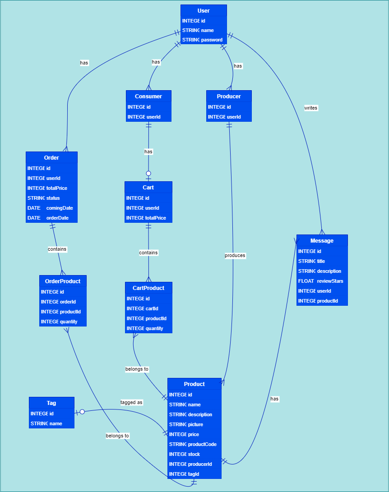

# Emag

Acest API este facut cu node.js, express, cu GraphQl si sqlite ca baza de date. 

Aplicatia a fost creata pentru a gestiona un magazin online care are consumatori si producatori.

Avem mai multe functii ce depind ce tipul de user.
Oricine:
- Poate sa creeze un cont (consumator sau producator)
- Sa isi dea login pentru a primi un token JWT

Consumatorii:
- Adauga produse in cos
- Adauga un review la un produs
- Plaseaza o comanda
- Vad toate produsele
- Vad toate mesajele
- Pot vedea un singur produs
- Vad fiecare producator cu produsele lui

Producatorii:
- Adauga produse in baza de date
- Sterg produse
- Sa vada statistici despre vanzari
- Sa filtreze produsele dupa: tag, taguri sau numarul maxim de cantitate al unui produs

Pentru a intelege pe deplin legaturile din baza de date, va lasam aici o diagrama relationala:

In plus, fisierul `simulateTraffic.js` creeaza un flux continuu de comenzi, astfel incat statisticile generate pentru producatori sa fie observabile in timp real. Avem 50 de consumatori ce fac comenzi intr-un interval de 500 de milisecunde si o comanda ajunge la consumator in cateva secunde (ceea ce inseaman ca producatorul a primit bani).    

In final, o sa putem observa `venitul lunar`, si `fiecare produs` cu: cantitatea vanduta deja, cantitatea care trebuie expediata, cat profit s-a facut pe produs, si ce cantitate a ramas.
